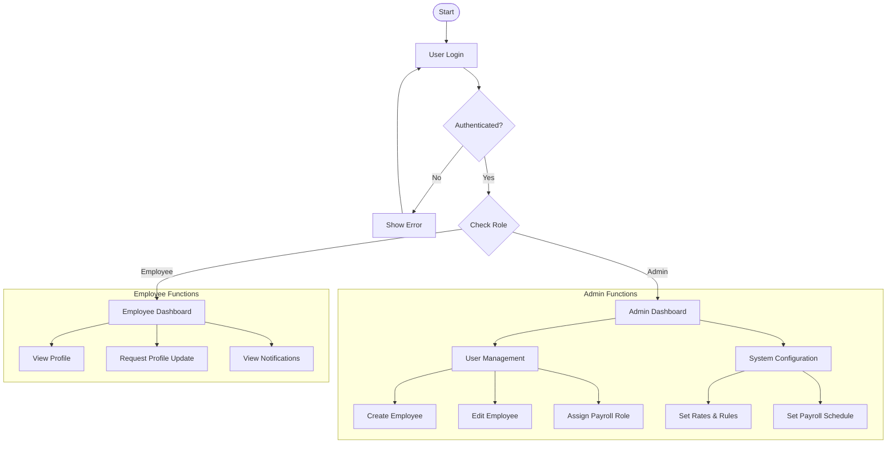
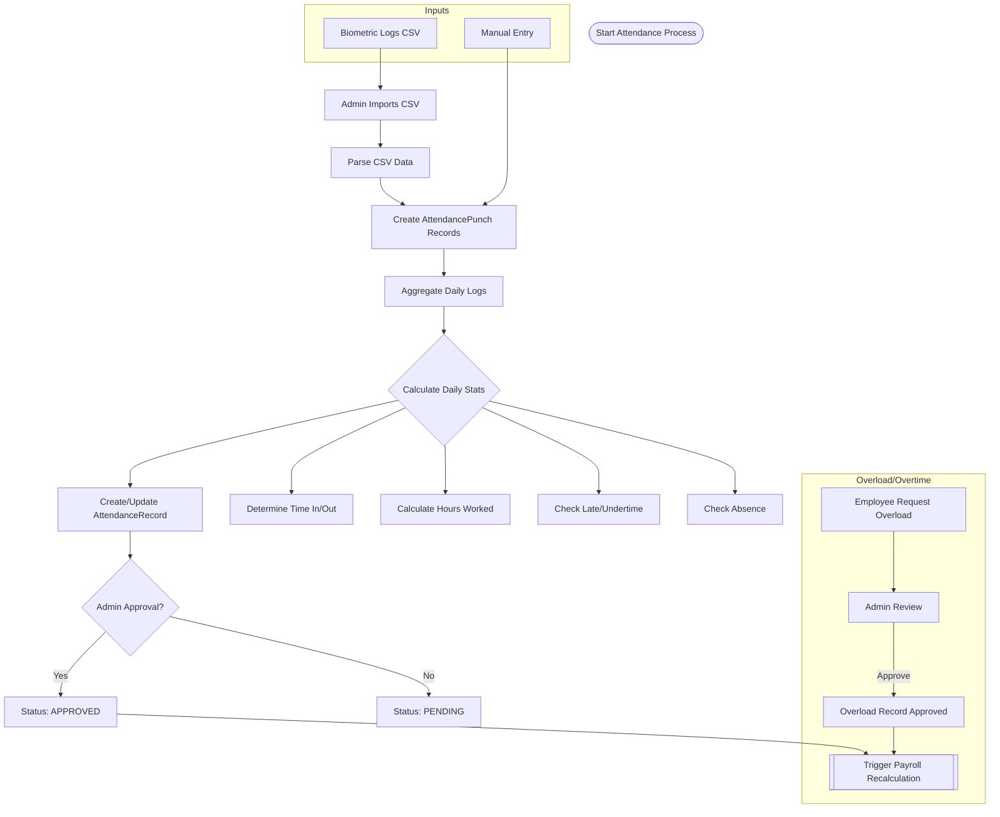
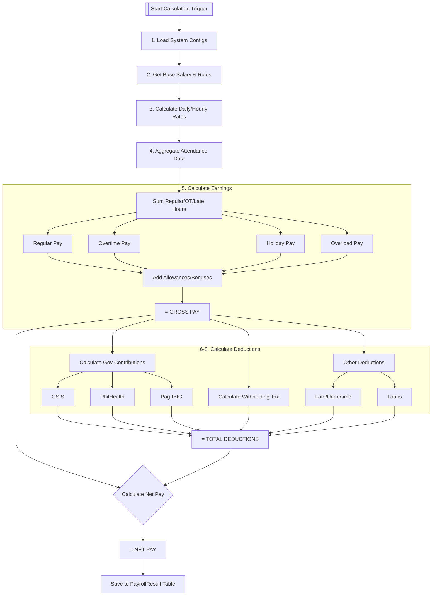
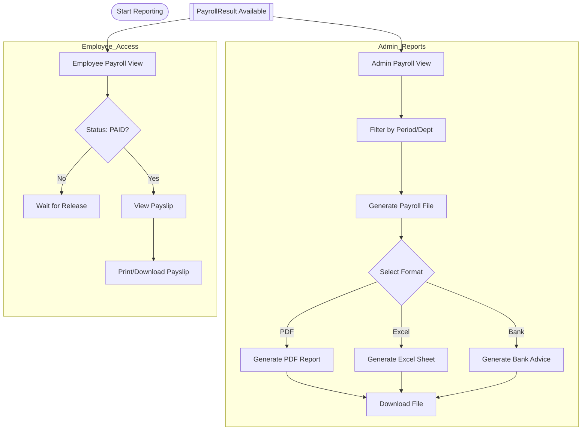

# System Flowcharts

These flowcharts describe the logic of the BISUpayroll system, divided into logical sections suitable for printing on letter-sized paper.

## Part 1: Authentication & User Management

## Part 2: Attendance Tracking System

## Part 3: Payroll Calculation Logic (Database Level)

## Part 4: Reporting & Output

