# BISU Payroll System - Complete Flow Visualization

## 🎯 System Overview

The BISU Payroll System consists of three main processes:
1. **Payroll Ledger Creation** - Admin generates payroll for all employees
2. **Payroll Calculations** - Complex formula-based calculations using multiple data sources
3. **Individual Payslip Generation** - Employee gets their detailed payslip

---

## 📊 Data Sources and Flow Architecture

```mermaid
graph TB
    %% Data Sources
    subgraph "📊 Data Sources"
        A[Attendance Records]
        B[Employee Data]
        C[Payroll Rules]
        D[System Settings]
        E[Holidays Calendar]
        F[Tax & Contribution Config]
    end
    
    %% Core Processing
    subgraph "⚙️ Payroll Engine"
        G[Payroll Generation API]
        H[Calculation Engine]
        I[Rule Application Engine]
    end
    
    %% Storage
    subgraph "💾 Storage"
        J[PayrollResult Table]
        K[PayrollRecord Table]
        L[Encrypted Files]
    end
    
    %% Output
    subgraph "📄 Output"
        M[Admin Payroll Ledger]
        N[Employee Payslip]
        O[PDF/DOCX Files]
    end
    
    A --> G
    B --> G
    C --> G
    D --> G
    E --> G
    F --> G
    
    G --> H
    H --> I
    I --> J
    I --> K
    
    J --> M
    K --> N
    M --> L
    N --> O
```



---

## 🔄 1. Payroll Ledger Creation Process

### **Admin Workflow**


### **Data Collection Formula**

```sql
-- Employee Selection Query
SELECT u.*, pr.payrollRule 
FROM users u
LEFT JOIN payrollRules pr ON pr.applyToAll = true OR pr.assignedUsers CONTAINS u.id
WHERE u.role = 'EMPLOYEE' 
  AND u.status = 'ACTIVE'
  AND (u.department = @selectedDept OR @selectedDept = 'all')

-- Attendance Data for Period
SELECT date, timeIn, timeOut, hoursWorked, isLate, isAbsent
FROM attendanceRecords 
WHERE userId = @userId 
  AND date BETWEEN @payPeriodStart AND @payPeriodEnd

-- Payroll Rules (Combined)
SELECT * FROM payrollRules 
WHERE (applyToAll = true OR assignedUsers CONTAINS @userId)
  AND isActive = true
```

---

## 🧮 2. Payroll Calculation Engine

### **Core Calculation Flow**


### **Detailed Calculation Formulas**

#### **Basic Rate Calculations**
```typescript
// Daily Rate (from payroll rules)
dailyRate = baseSalaryRule.amount

// Hourly Rate
hourlyRate = dailyRate / dailyHours (default: 8)
```

#### **Earnings Formulas**
```typescript
// Regular Pay
regularPay = (totalHours - overtimeHours - holidayHours) × hourlyRate

// Overtime Pay (Tiered rates)
overtimeFirst2Hours = Math.min(overtimeHours, 2) × hourlyRate × overtimeRate1 (1.25x)
overtimeRemaining = Math.max(0, overtimeHours - 2) × hourlyRate × overtimeRate2 (1.5x)
overtimePay = overtimeFirst2Hours + overtimeRemaining

// Holiday Pay (Additional only)
holidayPay = holidayHours × hourlyRate × (holidayRate - 1)
// Regular Holiday: 2.0x (so additional = 1.0x)
// Special Holiday: 1.3x (so additional = 0.3x)

// Rule-based Earnings
bonuses = SUM(bonusRules where isPercentage ? grossPay × rate/100 : fixedAmount)
allowances = SUM(allowanceRules where isPercentage ? basePay × rate/100 : fixedAmount)

// Gross Pay
grossPay = regularPay + overtimePay + holidayPay + bonuses + allowances + thirteenthMonth + SIL
```

#### **Government Contributions**
```typescript
// GSIS Contribution
contributionBase = dailyRate × daysWorked
gsisContribution = contributionBase × (employeeRate/100)
// Bracket-based or flat rate, subject to min/max limits

// PhilHealth Contribution  
philHealthContribution = Math.max(minContribution, 
  Math.min(maxContribution, contributionBase × (employeeRate/100)))

// Pag-IBIG Contribution
pagibigContribution = Math.max(minContribution,
  Math.min(maxContribution, contributionBase × (employeeRate/100)))
```

#### **Tax Calculation**
```typescript
// Taxable Income (Monthly)
taxableIncome = grossPay - gsisContribution - philHealthContribution - 
                pagibigContribution - thirteenthMonthPay - serviceIncentiveLeave

// Annualize for tax computation
workingDaysMonth = getWorkingDaysInMonth(year, month)
workingDaysYear = getWorkingDaysInYear(year)
monthlyEquivalent = taxableIncome × (22 / workingDaysMonth)
annualTaxableIncome = monthlyEquivalent × (workingDaysYear / 22)

// Apply tax brackets
for (bracket of taxBrackets) {
  if (annualTaxableIncome > bracket.min && annualTaxableIncome <= bracket.max) {
    taxableAmount = annualTaxableIncome - bracket.min
    annualTax = bracket.fixedAmount + (taxableAmount × bracket.rate/100)
    withholdingTax = annualTax / 12
    break
  }
}
```

#### **Other Deductions**
```typescript
// Late Deductions
switch (lateDeductionBasis) {
  case 'fixed': lateDeductions = lateHours × deductionAmount
  case 'hourly': lateDeductions = lateHours × hourlyRate × deductionAmount  
  case 'daily': lateDeductions = lateHours × dailyRate × deductionAmount
  case 'per_minute': lateDeductions = (lateHours × 60) × (hourlyRate/60) × deductionAmount
}

// Undertime Deductions
undertimeDeductions = undertimeHours × hourlyRate

// Rule-based Deductions
loanDeductions = SUM(loanRules.amount)
otherDeductions = SUM(otherDeductionRules where isPercentage ? grossPay × rate/100 : fixedAmount)

// Total Deductions
totalDeductions = gsisContribution + philHealthContribution + pagibigContribution + 
                  withholdingTax + lateDeductions + undertimeDeductions + 
                  loanDeductions + otherDeductions

// Net Pay
netPay = Math.max(0, grossPay - totalDeductions)
```

---

## 📋 3. Individual Employee Payslip Generation

### **Employee Payslip Workflow**


### **Payslip Data Structure**

```typescript
interface PayslipData {
  // Record Information
  payrollRecordId: string
  payPeriodStart: Date
  payPeriodEnd: Date
  generatedAt: Date
  
  // Employee Information
  employee: {
    name: string
    employeeId: string
    department: string
    position: string
    hireDate: Date
  }
  
  // Calculation Breakdown
  calculations: {
    monthlySalary: number        // Daily rate × 22
    basePay: number             // From PayrollRecord.baseSalary
    overtimePay: number         // From PayrollRecord.overtime
    bonuses: number             // From PayrollRecord.bonuses
    grossPay: number            // From PayrollRecord.grossPay
    netPay: number              // From PayrollRecord.netPay
    
    // Deduction breakdown (reconstructed from total)
    governmentDeductions: number
    loanDeductions: number
    otherDeductions: number
    lateDeductions: number
    totalDeductions: number
  }
  
  // Applied Rules (from JSON field)
  appliedRules: Array<{
    name: string
    type: 'bonus' | 'allowance' | 'deduction'
    amount: number
    calculatedAmount: number
    isPercentage: boolean
  }>
}
```

### **Template Data Binding**

The payslip uses a DOCX template (`public/sap.docx`) with placeholder variables:

```typescript
const templateContext = {
  // Header Information
  company_name: 'BISU Payroll System',
  payslip_title: 'Employee Payslip',
  period_start: '2025-01-01',
  period_end: '2025-01-31',
  generated_at: '2025-01-31 14:30',
  
  // Employee Details
  employee_name: 'Juan Dela Cruz',
  employee_id: 'EMP001',
  employee_department: 'IT Department',
  employee_position: 'Software Developer',
  employee_hire_date: '2024-01-15',
  
  // Salary Information
  monthly_salary: '₱30,000.00',
  base_pay: '₱25,000.00',
  overtime_pay: '₱2,500.00',
  bonuses_pay: '₱1,500.00',
  gross_pay: '₱29,000.00',
  
  // Deductions
  government_deductions: '₱3,500.00',
  loan_deductions: '₱1,000.00', 
  other_deductions: '₱500.00',
  total_deductions: '₱5,000.00',
  
  // Final Amount
  net_pay: '₱24,000.00',
  net_pay_words: 'Twenty Four Thousand Pesos',
  
  // Detailed Rules Tables
  earnings_rules: [
    { rule_name: 'Performance Bonus', rule_amount: '₱1,500.00', rule_rate: '5%' }
  ],
  deduction_rules: [
    { rule_name: 'SSS Loan', rule_amount: '₱1,000.00', rule_rate: '' }
  ],
  
  reference_id: 'PR-2025-001-001'
}
```

---

## 🔒 Security and File Management

### **Encrypted File Storage**
```typescript
// Files are encrypted and stored securely
const encryptedContent = await encryptPayrollFile(pdfBuffer, fileName)
await saveToSecureDirectory(`/secure-payroll-files/${month}/`, encryptedContent)

// File metadata stored in database
await prisma.payrollFile.create({
  data: {
    fileName,
    filePath: `/payroll-files/${fileName}`,
    fileSize: buffer.length,
    fileType: 'pdf',
    reportType: 'monthly',
    payPeriodStart,
    payPeriodEnd,
    generatedBy: adminUser.id,
    employeeCount,
    totalGrossPay,
    totalNetPay,
    metadata: { departments, generationTime }
  }
})
```

---

## 📊 Database Schema Relationships


---

## 🎯 Key Benefits of This Architecture

1. **Separation of Concerns**: Ledger generation (admin) vs individual payslips (employee)
2. **Dual Storage**: PayrollResult (detailed) and PayrollRecord (simplified) for backward compatibility
3. **Rule-Based Flexibility**: Configurable earnings and deductions through payroll rules
4. **Accurate Calculations**: Formula-based computations with proper tax and contribution handling
5. **Security**: Encrypted file storage with comprehensive metadata
6. **Auditability**: Complete calculation breakdown stored as JSON
7. **Scalability**: Batch processing for multiple employees with error handling

This architecture ensures accurate, auditable, and secure payroll processing while maintaining flexibility for various organizational needs.